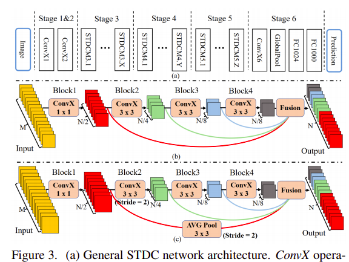
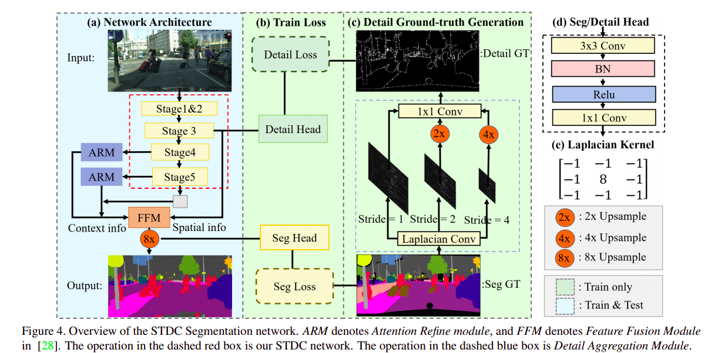
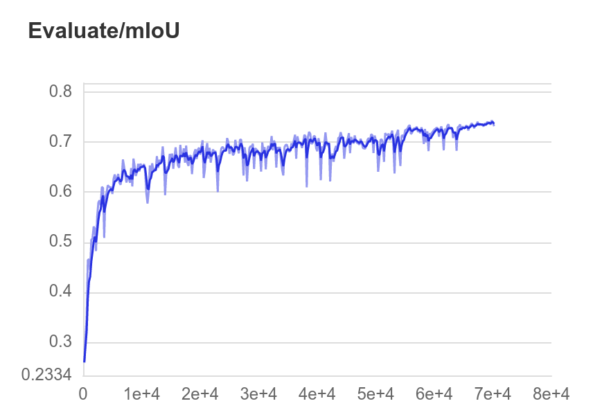

# STDCNet-Seg

_Use PaddlePaddle to implementate STDCNet-Seg (Segmentation Only)_


## 1. Introduction

This project reproduces STDCNet-Seg based on paddlepaddle framework.
本项目利用百度的paddlepaddle框架对CVPR2021论文Rethinking BiSeNet For Real-time Semantic Segmentation的复现.
这里只做在Cityscapes数据集上的对于STDC2-Seg50的分割实验，不包括STDCNet的ImageNet分类实验.
项目依赖于paddleseg工具，模型的输出形式与paddleseg中的模型输出类似，因此可以利用paddleseg提供的训练和评估代码进行训练和评估.


**Paper:** [Rethinking BiSeNet For Real-time Semantic Segmentation](https://arxiv.org/abs/2104.13188)

**Competition Page:** [PaddlePaddle AI Studio](https://aistudio.baidu.com/aistudio/competition/detail/106)

**STDC Architecture:**



**STDC-Seg Architecture:**



**Other Version Implementation:**

- [PyTorch](https://github.com/MichaelFan01/STDC-Seg)


## 2. Metrics

**复现结果**：

- Backbone利用ImageNet上的预训练Pytorch模型参数转为Paddle模型参数，采用80000 iter，batch_size=36，base_lr=0.01 warmup+poly的学习率策略，**STDCNet2-Seg50模型在Cityscaps VAL数据集上达到了74.37(now best,完整训练还未完成)的mIOU**。***说明：采用这个方案的原因是因为AIStudio提供的单卡32G环境允许的1024×512输入最大的batch_size为36，若内存够用/使用多卡，还是推荐使用作者提供的参数。*

- 补充实验（单次实验结果）：Backbone无ImageNet上预训练的模型，在60000 iters, batch_size = 32，0.01 poly（原论文60000 iters，batch_size=48，warmup+poly，有ImageNet预训练模型）的情况下，STDCNet2-Seg50模型在Cityscaps VAL数据集上达到了67.72的best mIOU。继续用该训模型进行进一步训练，60000 iters，batch_size = 32，0.001 poly, STDCNet2-Seg50模型在Cityscaps VAL数据集上达到了69.47的best mIOU。

**Tips**：结果表明，预训练模型对于数据量不大的数据集非常重要！！！

**Result in Cityscapes(val)**

| Model                   | mIOU |
| ----------------------- | -------- |
| STDC2-Seg50 (Pytorch)     | 74.2     |
| STDC2-Seg50 (PaddlePaddle) | 74.37(now best)     |

asserts 里面有Evaluate_mIoU的曲线图。



## 3. Dataset

### [Cityscapes](https://www.cityscapes-dataset.com/)

data should be located at data/;

数据集应有的结构:
```
data/
├── cityscapes
│   ├── gtFine
│   │   ├── test
│   │   ├── train
│   │   └── val
│   ├── leftImg8bit
│   │   ├── test
│   │   │   ├── berlin
│   │   │   ├── ...
│   │   │   └── munich
│   │   ├── train
│   │   │   ├── aachen
│   │   │   ├── ...
│   │   │   └── zurich
│   │   └── val
│   │       ├── frankfurt
│   │       ├── lindau
│   │       └── munster
│   ├── train.txt
│   ├── val.txt
│   ├── test.txt

```

.txt format style like as follow:

```leftImg8bit/test/mainz/mainz_000001_036412_leftImg8bit.png,gtFine/test/mainz/mainz_000001_036412_gtFine_labelTrainIds.png```

which can achieved by use PaddleSeg's create_dataset_list.py(need to clone PaddleSeg from PaddleSeg's git repo firstly):
 
```
python PaddleSeg/tools/create_dataset_list.py ./data/cityscapes/ --type cityscapes --separator ","

```
## 4. Environment

- Hardware: GPU/CPU
- Framework:
  - PaddlePaddle >= 2.0.2

## 5. Quick Start

### install paddleseg tool(cmd line)

```pip install paddleseg```

### Train(include Val(in eval mode))

- 单块32G GPU训练（多线程大约40多个小时，单线程70多个小时）：

```
python train.py

```

The model will be saved at output/ by default.

### val/test

Model outout format is similar with paddleseg model output so that you can val/test it with paddleseg tool easily by yourself. 只需要用下面的代码替换掉train.py里的train()部分就可以了，不过得在前面加载预训练的模型（load and set参数），即```pretrain_path = 'pretrained/STDCNet1446_76.47.pdiparams' ```# backbone预训练模型参数改为```pretrain_path=None```，并将```# 加载模型参数部分 ```注释去掉，改对应参数路径。
eg:

``` 
from paddleseg.core import evaluate
evaluate(model,
             val_dataset,
             aug_eval=True,
             scales=0.5, # m50; m75: scales=0.75
             flip_horizontal=False,
             flip_vertical=False,
             is_slide=False,
             stride=None,
             crop_size=None,
             num_workers=0,
             print_detail=True)

```

The code will release as soon as possible.

#### Train Parameters Setting/Description:

details in train.py.

## 6. Details

### Project Structure
```
├── README.md
├── asserts/
├── data/
├── work/
├── models/
├── loss/
├── tool/
├── scheduler/
├── pretrained/
├── output/
├── train.log
├── requirements.txt
└── train.py
```


## 7. Author Information

For other information about the model, please refer to the following table:
| Information       | Description                                         |
| ----------------- | ----------------------------------------            |
| Author            | xbchen                                              |
| Date              | 2021.8                                              |
| Framework version | Paddle 2.0.2 On AIStudio                            |
| Support hardware  | GPU(V100 32G)/CPU                                   |
| Download link     | [Pretrained backbone: 提取码：tss7](https://pan.baidu.com/s/16kh3aHTBBX6wfKiIG-y3yA) |
| Download link     | [STDC2-Seg50: 提取码：nchx](https://pan.baidu.com/s/1sFHqZWhcl8hFzGCrXu_c7Q) |
| Online operation  | Notebook will be avalible soon                      |
